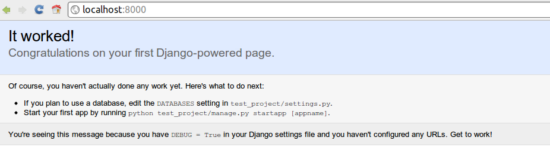
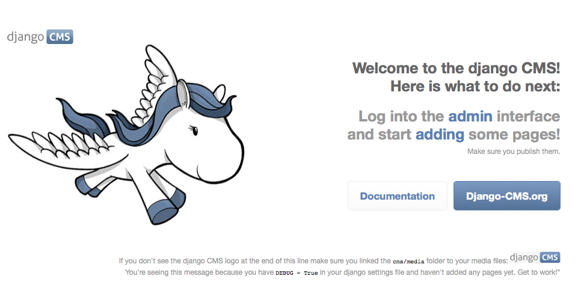
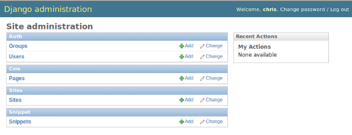
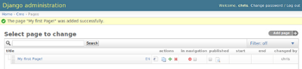
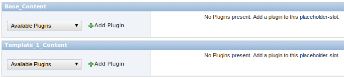
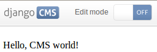

djangoCMS Tutorial - Step 1
===========================
Hey, you made it! Awesome. Now let's get started by setting up our environment.

Preparing the environment
-------------------------

```
# Install dependencies
$ sudo pip install --upgrade virtualenv
$ sudo pip install --upgrade django
```


Setup Django
------------
Gathering the requirements is a good start, but we now need to give the
CMS a Django project to live in, and configure it.

```
# Start django project
$ cd djangocms-tutorial
$ django-admin.py startproject myproject

# make virtualenv for project + install project dependencies
$ cd myproject
$ virtualenv --no-site-packages env
$ source env/bin/activate
$ pip install --upgrade django

# try & check if it worked at localhost:8000
$ python manage.py runserver
```


Setup djangoCMS
---------------
We proceed by install the latest version of djangoCMS directly from Github. Stop your server (`Ctrl+C`) and:

```
# install latest egg from github
$ pip install git+git://github.com/divio/django-cms.git#egg=django-cms
```


### Installing and configuring django CMS in your Django project

Open the file `~/workspace/myproject/settings.py`.

To make your life easier, add the following at the top of the file:

    # -*- coding: utf-8 -*-
    import os
    gettext = lambda s: s
    PROJECT_PATH = os.path.split(os.path.abspath(os.path.dirname(__file__)))[0]

Add the following apps to your django:INSTALLED\_APPS. This includes
django CMS itself as well as its dependenices and other highly
recommended applications/libraries:

-   `'cms'`, django CMS itself
-   `'mptt'`, utilities for implementing a modified pre-order traversal
    tree
-   `'menus'`, helper for model independent hierarchical website
    navigation
-   `'south'`, intelligent schema and data migrations
-   `'sekizai'`, for javascript and css management

Also add any (or all) of the following plugins, depending on your needs:

-   `'cms.plugins.file'`
-   `'cms.plugins.flash'`
-   `'cms.plugins.googlemap'`
-   `'cms.plugins.link'`
-   `'cms.plugins.picture'`
-   `'cms.plugins.snippet'`
-   `'cms.plugins.teaser'`
-   `'cms.plugins.text'`
-   `'cms.plugins.video'`
-   `'cms.plugins.twitter'`

> **warning**
>
> Adding the `'cms.plugins.snippet'` plugin is a potential security
> hazard. For more information, refer to snippets-plugin.

The plugins are described in more detail in chapter
Plugins reference \<plugin\_reference\>. There are even more plugins
available on the django CMS [extensions
page](http://www.django-cms.org/en/extensions/).

In addition, make sure you uncomment (enable) `'django.contrib.admin'`

you may also wish to use
[django-filer](https://github.com/stefanfoulis/django-filer) and its
components with the [django CMS
plugin](https://github.com/stefanfoulis/cmsplugin-filer) instead of the
cms.plugins.file, cms.plugins.picture, cms.plugins.teaser and
cms.plugins.video core plugins. In this case you should not add them to
django:INSTALLED\_APPS but add the following instead:

-   `'filer'`
-   `'cmsplugin_filer_file'`
-   `'cmsplugin_filer_folder'`
-   `'cmsplugin_filer_image'`
-   `'cmsplugin_filer_teaser'`
-   `'cmsplugin_filer_video'`

If you opt for the core plugins you should take care that directory to
which the CMS\_PAGE\_MEDIA\_PATH setting points (by default
`cms_page_media/` relative to django:MEDIA\_ROOT) is writable by the
user under which Django will be running. If you have opted for
django-filer there is a similar requirement for its configuration.

If you want versioning of your content you should also install
[django-reversion](https://github.com/etianen/django-reversion) and add
it to django:INSTALLED\_APPS:

-   `'reversion'`

You need to add the django CMS middlewares to your
django:MIDDLEWARE\_CLASSES at the right position:

    MIDDLEWARE_CLASSES = (
        'django.contrib.sessions.middleware.SessionMiddleware',
        'django.middleware.csrf.CsrfViewMiddleware',
        'django.contrib.auth.middleware.AuthenticationMiddleware',
        'django.contrib.messages.middleware.MessageMiddleware',
        'django.middleware.locale.LocaleMiddleware',
        'django.middleware.doc.XViewMiddleware',
        'django.middleware.common.CommonMiddleware',
        'cms.middleware.page.CurrentPageMiddleware',
        'cms.middleware.user.CurrentUserMiddleware',
        'cms.middleware.toolbar.ToolbarMiddleware',
        'cms.middleware.language.LanguageCookieMiddleware',
    )

You need at least the following django:TEMPLATE\_CONTEXT\_PROCESSORS:

    TEMPLATE_CONTEXT_PROCESSORS = (
        'django.contrib.auth.context_processors.auth',
        'django.core.context_processors.i18n',
        'django.core.context_processors.request',
        'django.core.context_processors.media',
        'django.core.context_processors.static',
        'cms.context_processors.media',
        'sekizai.context_processors.sekizai',
    )

> **note**
>
> This setting will be missing from automatically generated Django
> settings files, so you will have to add it.

Point your django:STATIC\_ROOT to where the static files should live
(that is, your images, CSS files, Javascript files, etc.):

    STATIC_ROOT = os.path.join(PROJECT_PATH, "static")
    STATIC_URL = "/static/"

For uploaded files, you will need to set up the django:MEDIA\_ROOT
setting:

    MEDIA_ROOT = os.path.join(PROJECT_PATH, "media")
    MEDIA_URL = "/media/"

> **note**
>
> Please make sure both the `static` and `media` subfolders exist in
> your project and are writable.

Now add a little magic to the django:TEMPLATE\_DIRS section of the file:

    TEMPLATE_DIRS = (
        # The docs say it should be absolute path: PROJECT_PATH is precisely one.
        # Life is wonderful!
        os.path.join(PROJECT_PATH, "templates"),
    )

Add at least one template to CMS\_TEMPLATES; for example:

    CMS_TEMPLATES = (
        ('template_1.html', 'Template One'),
        ('template_2.html', 'Template Two'),
    )

We will create the actual template files at a later step, don't worry
about it for now. Simply paste this code into your settings file.

> **note**
>
> The templates you define in CMS\_TEMPLATES have to exist at runtime
> and contain at least one `` template tag to be
> useful for django CMS. For more details see Creating templates\_

The django CMS allows you to edit all languages for which Django has
built in translations. Since these are numerous, we'll limit it to
English for now:

    LANGUAGES = [
        ('en', 'English'),
    ]

Finally, set up the django:DATABASES part of the file to reflect your
database deployment. If you just want to try out things locally, sqlite3
is the easiest database to set up, however it should not be used in
production. If you still wish to use it for now, this is what your
django:DATABASES setting should look like:

    DATABASES = {
        'default': {
            'ENGINE': 'django.db.backends.sqlite3',
            'NAME': os.path.join(PROJECT_PATH, 'database.sqlite'),
        }
    }

### URL configuration

You need to include the `'cms.urls'` urlpatterns **at the end** of your
urlpatterns. We suggest starting with the following `urls.py`:

    from django.conf.urls.defaults import *
    from django.conf.urls.i18n import i18n_patterns
    from django.contrib import admin
    from django.conf import settings

    admin.autodiscover()

    urlpatterns = i18n_patterns('',
        url(r'^admin/', include(admin.site.urls)),
        url(r'^', include('cms.urls')),
    )

    if settings.DEBUG:
        urlpatterns = patterns('',
        url(r'^media/(?P<path>.*)$', 'django.views.static.serve',
            {'document_root': settings.MEDIA_ROOT, 'show_indexes': True}),
        url(r'', include('django.contrib.staticfiles.urls')),
    ) + urlpatterns

Creating templates
------------------

django CMS uses templates to define how a page should look and what
parts of it are editable. Editable areas are called **placeholders**.
These templates are standard Django templates and you may use them as
described in the [official
documentation](http://docs.djangoproject.com/en/1.5/topics/templates/).

Templates you wish to use on your pages must be declared in the
CMS\_TEMPLATES setting:

    CMS_TEMPLATES = (
        ('template_1.html', 'Template One'),
        ('template_2.html', 'Template Two'),
    )

If you have followed this tutorial from the beginning, this code should
already be in your settings file.

Now, on with the actual template files!

Fire up your favorite editor and create a file called `base.html` in a
folder called `templates` in your myproject directory.

Here is a simple example for a base template called `base.html`:

~~~~ {.sourceCode .html+django}

<html>
  <head>
      
  </head>
  <body>
      
      
      
      
  </body>
</html>
~~~~

Now, create a file called `template_1.html` in the same directory. This
will use your base template, and add extra content to it:

~~~~ {.sourceCode .html+django}




  

~~~~

When you set `template_1.html` as a template on a page you will get two
placeholders to put plugins in. One is `template_1_content` from the
page template `template_1.html` and another is `base_content` from the
extended `base.html`.

When working with a lot of placeholders, make sure to give descriptive
names to your placeholders so you can identify them more easily in the
admin panel.

Now, feel free to experiment and make a `template_2.html` file! If you
don't feel creative, just copy template\_1 and name the second
placeholder something like "template\_2\_content".

### Static files handling with sekizai

The django CMS handles media files (css stylesheets and javascript
files) required by CMS plugins using
[django-sekizai](https://github.com/ojii/django-sekizai). This requires
you to define at least two sekizai namespaces in your templates: `js`
and `css`. You can do so using the `render_block` template tag from the
`sekizai_tags` template tag libary. We highly recommended putting the
`` tag as the last thing before the closing
`</head>` HTML tag and the `` tag as the last
thing before the closing `</body>` HTML tag.

### Initial database setup

This command depends on whether you **upgrade** your installation or do
a **fresh install**. We recommend that you get familiar with the way
[South](http://south.aeracode.org/) works, as it is a very powerful,
easy and convenient tool. django CMS uses it extensively.

#### Fresh install

Run:

    python manage.py syncdb --all
    python manage.py migrate --fake

The first command will prompt you to create a super user. Choose 'yes'
and enter appropriate values.

#### Upgrade

Run:

    python manage.py syncdb
    python manage.py migrate

### Check you did everything right

Now, use the following command to check if you did everything correctly:

    python manage.py cms check

### Up and running!

That should be it. Restart your development server using
`python manage.py runserver` and point a web browser to
[127.0.0.1:8000](http://127.0.0.1:8000) :you should get the django CMS
"It Worked" screen.



Head over to the admin panel \<http://127.0.0.1:8000/admin/\> and log in
with the user you created during the database setup.

To deploy your django CMS project on a production webserver, please
refer to the [Django
documentation](http://docs.djangoproject.com/en/1.2/howto/deployment/).

Creating your first CMS Page!
-----------------------------

That's it. Now the best part: you can start using the CMS! Run your
server with `python manage.py runserver`, then point a web browser to
[127.0.0.1:8000/admin/](http://127.0.0.1:8000/admin/) , and log in using
the super user credentials you defined when you ran `syncdb` earlier.

Once in the admin part of your site, you should see something like the
following:



### Adding a page

Adding a page is as simple as clicking "Pages" in the admin view, then
the "add page" button at the top right-hand corner of the screen.

This is where you select which template to use (remember, we created
two), as well as pretty obvious things like which language the page is
in (used for internationalisation), the page's title, and the url slug
it will use.

Hitting the "Save" button, unsurprisingly, saves the page. It will now
display in the list of pages.



Congratulations! You now have a fully functional django CMS
installation!

### Publishing a page

The following is a list of parameters that can be changed for each of
your pages:

#### Visibility

By default, pages are "invisible". To let people access them you should
mark them as "published".

#### Menus

Another option this view lets you tweak is whether or not the page
should appear in your site's navigation (that is, whether there should
be a menu entry to reach it or not)

### Adding content to a page

So far, our page doesn't do much. Make sure it's marked as "published",
then click on the page's "edit" button.

Ignore most of the interface for now and click the "view on site" button
at the top right-hand corner of the screen. As expected, your page is
blank for the time being, since our template is a really minimal one.

Let's get to it now then!

Press your browser's back button, so as to see the page's admin
interface. If you followed the tutorial so far, your template
(`template_1.html`) defines two placeholders. The admin interfaces shows
you theses placeholders as sub menus:



Scroll down the "Available plugins" drop-down list. This displays the
plugins you added to your django:INSTALLED\_APPS settings. Choose the
"text" plugin in the drop-down, then press the "Add" button.

The right part of the plugin area displays a rich text editor
([TinyMCE](http://tinymce.moxiecode.com/)).

In the editor, type in some text and then press the "Save" button.

The new text is only visible on the draft copy so far, but you can see
it by using the top button "Preview draft". If you use the "View on
site" button instead, you can see that the page is still blank to the
normal users.

To publish the changes you have made, click on the "Publish draft"
button. Go back to your website using the top right-hand "View on site"
button. That's it!




### Where to go from here

Congratulations, you now have a fully functional CMS! Awesome job! Let's continue by checking out branch 'step-2' (You should know how that works by now :)
